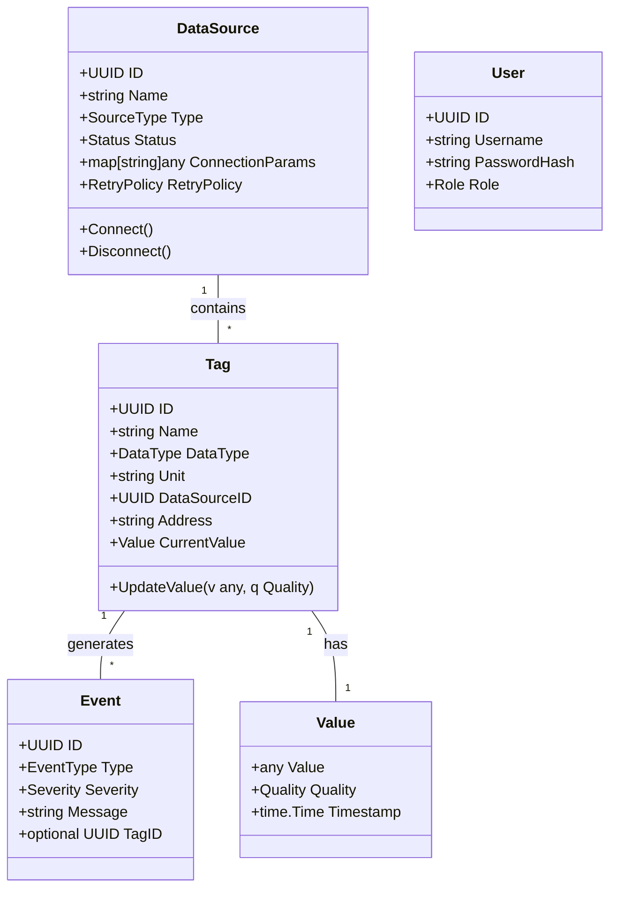

```mermaid
classDiagram
    class DataSource {
        +UUID ID
        +string Name
        +SourceType Type
        +Status Status
        +map[string]any ConnectionParams
        +RetryPolicy RetryPolicy
        +Connect()
        +Disconnect()
    }

    class Tag {
        +UUID ID
        +string Name
        +DataType DataType
        +string Unit
        +UUID DataSourceID
        +string Address
        +Value CurrentValue
        +UpdateValue(v any, q Quality)
    }

    class Value {
        +any Value
        +Quality Quality
        +time.Time Timestamp
    }

    class Event {
        +UUID ID
        +EventType Type
        +Severity Severity
        +string Message
        +optional UUID TagID
    }

    class User {
        +UUID ID
        +string Username
        +string PasswordHash
        +Role Role
    }

    DataSource "1" -- "*" Tag : contains
    Tag "1" -- "*" Event : generates
    Tag "1" -- "1" Value : has
```
